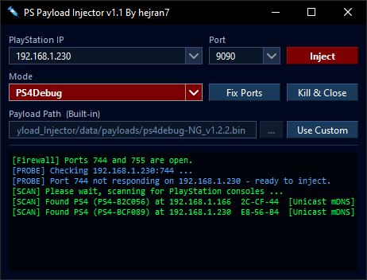

# PS Payload Injector v1.1

A Simple Windows GUI tool for sending payloads to a PS4 or PS5 over the local network.

  

---

## Features

- **PS4Debug & PS5Debug modes** — switch between PS4 and PS5; injection port defaults automatically (9090 for PS4, 9021 for PS5)
- **Built-in payloads** — comes with [ps4debug-NG](https://github.com/OpenSourcereR-dev/ps4debug-NG) (v1.2.2) and [ps5debug-NG](https://github.com/OpenSourcereR-dev/ps5debug-NG) (v1.2.7), by [OpenSourcereR-dev](https://github.com/OpenSourcereR-dev), set as the defaults. The original `ps4debug v1.1.19` / `ps5debug v1.0b5` builds by Ctn123/SiSTR0 are also bundled in `data/payloads` as fallback options — select them via `Use Custom`
- **Custom payload support** — browse for any payload  `.bin`, `.elf`, `.js`, `.lua`, `.jar`, or drag-and-drop it directly onto the path field.
- **Custom port** — type any port number directly into the port field; recent ports are saved in a dropdown.
- **Auto-detect** — probes port 744 on startup; if the debug server is already running the Inject button is disabled and you are notified
- **Auto LAN scan** — on startup, automatically scans the local network for PS4/PS5 consoles using multiple methods (Windows DNS cache, mDNS multicast, SSDP, TCP probe → ARP → Unicast mDNS); results show the console name, IP, MAC prefix, and detection method
- **IP & port history** — recently used IPs and ports are saved and accessible from a dropdown for easy access.
- **Firewall helper** — on every startup, checks whether inbound TCP ports 744 and 755 are open or blocked; if blocked, shows a popup immediately and offers to apply the correct inbound rules automatically (UAC-elevated); also detects and removes block rules added by other applications
---

## Usage

Download the latest release from the [Releases](../../releases) page and run `PS-Payload-Injector_v1.1.exe` — no installation required.

1. Enter your PlayStation's local IP address
2. Select **PS4Debug** or **PS5Debug** mode
3. Optionally change the port (defaults: 9090 for PS4, 9021 for PS5)
4. Leave the payload on Built-in, click `Use Custom` to browse, or drag-and-drop a `.bin` / `.elf` / `.js` / `.lua` / `.jar` file onto the path field
5. Click **Inject**

---

## Building from Source

If you'd rather not trust the prebuilt `.exe`, you can compile it yourself:

1. Clone or download this repository
2. Run `build.bat`
3. The compiled executable will be output to the project folder (or wherever `build.bat` places it)

This lets you inspect the source and build the binary on your own machine instead of relying on the release download.

---

## Built-in Payloads

| Mode | File | Version |
|------|------|---------|
| PS4Debug (default) | `ps4debug-NG_v1.2.2.bin` | 1.2.2 |
| PS5Debug (default) | `ps5debug-NG_v1.2.7.elf` | 1.2.7 |
| PS4Debug (fallback) | `ps4debug_v1.1.19.bin` | 1.1.19 |
| PS5Debug (fallback) | `ps5debug_v1.0b5.elf` | 1.0b5 |

---

## Notes

- The tool must be on the same local network as the console
- Run as a normal user; the firewall helper will request elevation only if needed
- Settings (IP history, port, last mode) are saved to `%USERPROFILE%\Documents\PS_Payload_Injector\data\settings.json`
- Payload injector can detect if the payload was already injected a second time and freeze or crash the PS4 or PS5 system

---

## Credits

Credit where credit is due — none of this works without the people who built ps4debug/ps5debug in the first place:

- **[jogolden](https://github.com/jogolden)** — original author of ps4debug
- **[Ctn123](https://github.com/ctn123)** and **[SiSTR0](https://github.com/SiSTR0)** — for their work on ps4debug/ps5debug
- **[OpenSourcereR-dev](https://github.com/OpenSourcereR-dev)** — this tool uses [ps4debug-NG](https://github.com/OpenSourcereR-dev/ps4debug-NG) and [ps5debug-NG](https://github.com/OpenSourcereR-dev/ps5debug-NG)

---

## License

MIT License — free to use, modify, and distribute. See [LICENSE](LICENSE) for details.
